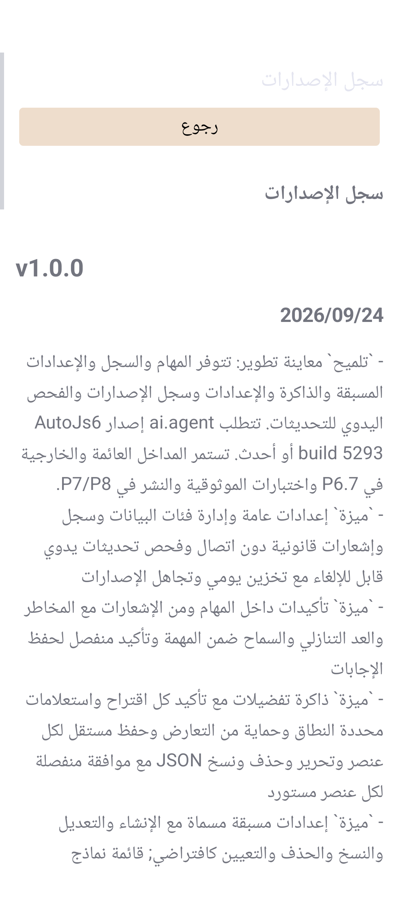

# P6.6 设置, 发行历史与手动更新, 2026-09-24

## 范围与阶段边界

本次实施原 P6.6 的设置主体, 内置发行历史/法律文档及手动更新检查. 不增加或拆分路线图条目. 从原宿主插件中心/抽屉打开任务台后可进入设置, 无需新增宿主接口.

P6.6 首项中的悬浮球开关及授权须与原 P6.7 的实际 `FloatingBall` 联验, 本次未提供无实际悬浮功能的开关, 未提前申请 `SYSTEM_ALERT_WINDOW`. 首项保持未勾选, 待 P6.7 一并闭合. 发行历史/更新与测试两项有独立完成证据. P7/P8 gate 不变.

用户本轮报告 Sony XQ-DQ72 (QV770340J7) 无法打开 build 56. 根因为 Android 13 的 `PhoneWindow.getInsetsController()` 在 decor 初始化前抛出 NPE. 修复独立提交 `a872174` / build 59; 本次设置功能为 build 60. 详见 [启动兼容性证据](android13-launch-evidence-2026-09-24.md). 后续回归设备列表包含该设备.

## 设置及任务策略

- `SettingsActivity` 跟随现有宿主外观, 覆盖 10 语言/11 资源目录, 草稿支持 Activity 重建. 私有 `IAgentSettings` 使用同 UID 校验, oneway 回调, 16 KiB 响应上限和 8 个在途请求限制; 文件读写在对应串行 worker 上完成.
- 设置为版本 1 私有原子文件, 最大 4 KiB. 错误类型, 非整数/超限预算, 重复/未知工具组和未来版本均拒绝. 损坏存储不会悄悄回退为更宽松配置.
- 全局工具组与宿主 grant 取交集; `gesture/files/shell` 初始关闭. OCR 即使勾选, 仍由宿主实际可用且授权的 OCR 能力控制. 单次任务及预设只能缩小范围, 不能绕过敏感操作确认. 删除显式 host toolGroups 约束不被视为收紧配置.
- 未配置预算仍为 40 步 / 60 次调用 / 300000 token, 普通任务 10 min / detached 30 min. 全局设置可在协议硬上限内调整: 200 步 / 300 次 / 1000000 token / 60 min. 普通任务时长仍截到 30 min, detached 最多 60 min. 有效预算还受预设和宿主 token 限制, 单次参数只允许继续收紧.
- 全局与预设任一启用审慎模式时, 单次任务不能改回 default. JS 与任务台共用准入, 入队固定设置/预设快照, 后续修改只影响新任务. 私有状态同步语音开关, 关闭时隐藏任务台语音按钮.
- 默认预设与既有预设存储共用; 脚本目录复用宿主批准流程. 数据管理显示历史/预设/记忆各自条数和字节占用, 分别确认清除, 有活动任务或另一次清除时拒绝执行. 准入与清除共享维护互斥, 清除预设保留一个初始内置 default. 记忆部分删除失败时发布实际剩余状态.
- 关于页面显示版本, 构建号, 日期, 作者, MPL-2.0 许可证, 第三方声明与源码入口. 许可证与声明从根文件生成 APK 资产, 无额外副本漂移.

## 发行历史与更新

- `ReleaseHistoryActivity` 为私有 Activity, 从当前 locale 的 APK changelog 读取, 中文地区映射和英文回退经 JVM 测试; 缺失/空内容显示本地化错误. 无 WebView 或远程资源执行. 同一页面白名单支持 LICENSE/THIRD_PARTY_NOTICES.
- 更新只由用户点击触发, 所有网络类型均不自动检查; 无需读取网络连接状态. `INTERNET` 仅为访问固定公开 GitHub Releases API 增加, 不发送目标/模型/历史/记忆内容, 不持有模型凭据.
- 成功结果缓存 24 h, 包括没有可用 release 的结果; 时钟回拨允许重新获取. 失败/取消不覆盖原成功缓存. 连接/读取超时各 10 s, 页面协调器总超时 25 s, 响应不超过 256 KiB, 严格 UTF-8; 不跟随重定向. 页面离开会取消并丢弃迟到结果.
- 版本按有界语义版本比较, release 数据拒绝 draft/prerelease, 外链限定本仓库的 HTTPS tag 页面. 支持忽略及取消忽略. 手动检查仍可查看被忽略版本; Neutral 打开应用内发行历史, Positive 打开浏览器发布页. 不下载或安装 APK.
- 网络契约参考 [GitHub 官方 Get the latest release](https://docs.github.com/en/rest/releases/releases#get-the-latest-release). HTTP 异常, body 上限, 编码和取消使用可控连接夹具; UI 更新测试使用受控 release, 不依赖线上是否已经发布 1.0.0.

## 验证

- Temurin 21: `:app:testDebugUnitTest`, `:app:assembleDebug`, `:app:assembleDebugAndroidTest`, `:app:lintDebug`, `:app:assembleRelease` 通过. JVM 452 项, 0 failure/error/skip. Lint 0 error / 6 个既有 warning, 未引入依赖变更.
- instrumentation 新增 8 个设置/更新测试及 1 个 Android 13 启动回归. 设置持久化和确认清除使用真实 store 的隔离目录; 跨进程用例通过真实 `:agent` Binder 往返, 修改后恢复原设置. 测试不会分类清除个人历史, 预设或记忆.
- 覆盖草稿与保存后重建, 磁盘重载, 默认预设选择, 清除取消与确认, 维护冲突, 三种内置文档, 更新缓存/忽略/两种导航, 失败/取消保留缓存, 阿拉伯语 RTL/夜间与字体 1.3 下的滚动布局. 首轮更新测试的异步等待与 HTTPS IntentFilter 缺项已修正, 未放宽断言.
- 完整设备矩阵与环境恢复结果在本文件末尾记录; 未执行真实 Model8/Gemma 推理或购物订单用例, 本轮不将夹具当成 E4 验收.

界面证据为隔离数据页面的 `View.draw` 产物, 不包含系统通知或个人任务内容:

## 相关仓库

- Documentation `e9ce36a` / 文档 code 78: 修改 `api/agentRunOptionsType.md`, `api/ai.md` 及进度/日志, 143 模块全量生成及 freshness 检查通过, 搜索索引 6224 项.
- Offline Docs `9b0830a` / build 59: dry-run 仅 5 个文档资产变化, `--sync-offline --verify-offline` 与规范化 no-op 通过, JVM 2 项. 使用包装脚本的 Python 入口而不加 `--increment-versions`, 避免已按提交管理的版本号重复自增.
- 离线 debug/release APK 同为 199 个文档文件 / 11594572 bytes, 内容 SHA-256 为 `2861378580108b3ecc2bc85ad771659800c1fc4108baeecddf38feab2e8a5a89`; 与已提交文档来源树逐文件一致 (仅文本 LF 规范化).
- 宿主仍为 `aeed8edcb9` / build 5293, 本次未修改. 公共 JS 签名/AIDL 未增加; TypeScript 与 Ace 无生成变更, 保留其原有用户工作. 未推送或发布.

原始构建/测试输出位于忽略的 `build/p66-*`, 文档生成与离线包验证均有对应日志.

## 本轮设备结果与恢复

| 设备 | 系统 | 最终构建 | 结果 |
| --- | --- | --- | --- |
| Sony G8441 / BH900ASK9E | API 28 | 60 | 全量 66 项通过, 249.054 s |
| AVD / emulator-5586 | API 37 / 16 KiB | 60 | 全量 66 项通过, 241.425 s |
| Sony XQ-DQ72 / QV770340J7 | API 33 | 59 (开发中 APK) | 启动/重建回归与冷启动通过, 冷启动 183 ms; 首轮设置测试 5/6 通过, 更新导航测试的异步/过滤器问题随后修正并在其余设备通过 |

G8441 与 AVD 的字体, 屏幕超时, 夜间和无障碍状态均与测试前快照比对恢复, 返回桌面; 仅关闭本会话启动的无窗口 AVD. 两台设备最后启动 build 60 成功. XQ-DQ72 在首轮测试之后断开 ADB, 暂未安装最终 build 60 或跑完整 66 项; 仍有临时屏幕超时 600000 ms 待恢复为基线值. 已向用户请求重新连接, 基线保存在忽略的 `build/p66-device-baseline.json`. 不把该设备首轮更新测试失败计为全量通过.
